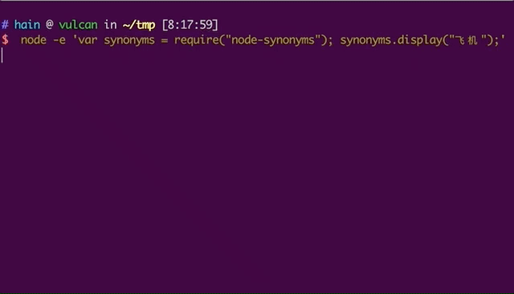

# Synonyms
[![node version][node-image]][node-url]
[![build status][travis-image]][travis-url]
[![codecov.io][codecov-image]][codecov-url]
[![David deps][david-image]][david-url]

[travis-image]: https://travis-ci.org/Samurais/node-synonyms.svg?branch=master
[travis-url]: https://travis-ci.org/Samurais/node-synonyms
[codecov-image]: https://img.shields.io/codecov/c/github/Samurais/node-synonyms/master.svg?style=flat-square
[codecov-url]: https://codecov.io/github/Samurais/node-synonyms?branch=master
[node-image]: https://img.shields.io/badge/node.js-%3E=_7-green.svg?style=flat-square
[node-url]: http://nodejs.org/download/
[david-image]: https://david-dm.org/Samurais/node-synonyms/status.svg
[david-url]: https://david-dm.org/Samurais/node-synonyms

[](https://nodei.co/npm/node-synonyms/)

Chinese Synonyms for Natural Language Processing and Understanding.

最好的中文近义词工具包。

```synonyms```可以用于自然语言理解的很多任务：文本对齐，推荐算法，相似度计算，语义偏移，关键字提取，概念提取，自动摘要，搜索引擎等。


[![chatoper banner][co-banner-image]][co-url]

[co-banner-image]: https://user-images.githubusercontent.com/3538629/42217321-3d5e44f6-7ef7-11e8-94e7-1574bfa1dbb8.png
[co-url]: https://www.chatopera.com

# Welcome
```
npm install node-synonyms
```

本项目为 [Synonyms](https://github.com/huyingxi/Synonyms/) 的 Node.js 版工具包，稳定版本为 v1，在*Mac OSX*及*Linux*下完成测试。目前打包后，npm module有47MB，是由于词表文件很大，下载时需要耐心。



支持使用环境变量配置：

| 环境变量 | 描述 | 默认值 |
| --- | ---  | --- |
| SYN_MODEL_W2V_PATH | word2vec训练后得到的词向量文件 | node_modules/node-synonyms/data/words.vector | 
| SYN_WORDSEG_CUSTOM_DICT | 分词用户词典 | node_modules/node-synonyms/data/tokenizer/user.dict.utf8 | 
| SYN_WORDSEG_STOPWORD_DICT | 分词停用词词典 | node_modules/node-synonyms/data/tokenizer/stop_words.utf8 |
| SYN_WORDSEG_PUNCT_DICT | 分词标点词典 | node_modules/node-synonyms/data/tokenizer/punctuation.utf8  |

# API

```
var synonyms = require("node-synonyms") # 使用上述环境变量做定制化
```

**所有接口返回值都是[Promise](https://developer.mozilla.org/en-US/docs/Web/JavaScript/Reference/Global_Objects/Promise)。**

## synonyms#seg(sentence, [stopwords, punct])
分词接口
```
let sen1 = "移动互联网";
synonyms.seg(sen1, true, true)
    .then(function(words){
        // do your magic
        });
```
stopwords(Boolean)是否保留停用词，punct(Boolean)是否保留标点符号。

* 返回值

[String]，词语组成的列表。

```
["移动","互联网"]
```

## synonyms#vector(word)
返回一个词语的向量
```
synonyms.vector("股市")
    .then(function(v){
        // do your magic
        })
```

* 返回值 JSONArray

```[float]```，100维的float值组成的向量。

## synonyms#display(word)
打印一个词语的邻居们及相关度
```
synonyms.display("飞机");
```

* 返回值
输出控制台，作为调试使用。

## synonyms#nearby(word)
返回一个词语的邻居们
```
synonyms.nearby("股市")
    .then(function(results){
            // do your magic
        });
```

* 返回值 JSONArray

```[[words], [scores]]```，包含两个列表，第一个是词语，第二个是对应位置词语的距离分数，同样是在[0~1]区间，越接近于1越相似。

比如：
```
[
    ["股市","股价","股票市场","股灾","楼市","股票","香港股市","行情","恒指","金融市场"],
    [1,0.786284,0.784575,0.751607,0.712255,0.712179,0.710806,0.694434,0.67501,0.666439]
]
```

## synonyms#compare(sentence1, sentence2)
比较两个句子的相似性
```
let sen1 = "移动互联网";
let sen2 = "互联网";
synonyms.compare(sen1, sen2)
    .then(function(similarity){
        // do your magic
    });
```
* 返回值 float

相似度是在置信区间[0~1]的float值，越接近于1越相似。

# Contribute
```
admin/test.sh # 单元测试
```

# Give credits to

[nodejieba](https://github.com/yanyiwu/nodejieba)

[fast-levenshtein](https://github.com/hiddentao/fast-levenshtein)

[compute-cosine-distance](https://github.com/compute-io/cosine-distance)

[node-word2vec-reader](https://www.npmjs.com/package/node-word2vec-reader)

# Statement
Synonyms发布证书 GPL3.0。数据和程序可用于研究和商业产品，必须注明引用和地址，比如发布的任何媒体、期刊、杂志或博客等内容。

```
@online{Synonyms:hain2017,
  author = {Hai Liang Wang, Hu Ying Xi},
  title = {中文近义词工具包Synonyms},
  year = 2017,
  url = {https://github.com/huyingxi/Synonyms},
  urldate = {2017-09-27}
}
```
